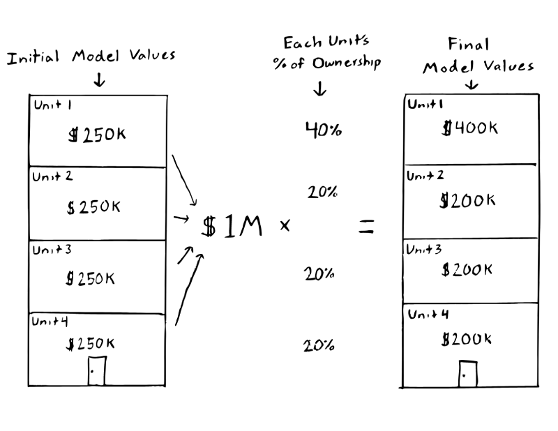

Table of Contents
================

-   [Model Overview](#model-overview)
    -   [Differences Compared to the Residential
        Model](#differences-compared-to-the-residential-model)
        -   [Features Used](#features-used)
        -   [Valuation](#valuation)
    -   [Condo Strata](#condo-strata)
-   [Ongoing Issues](#ongoing-issues)
    -   [Unit Heterogeneity](#unit-heterogeneity)
    -   [Buildings Without Sales](#buildings-without-sales)
-   [FAQs](#faqs)
-   [Usage](#usage)
-   [License](#license)
-   [Contributing](#contributing)

<!-- README.md is generated from README.Rmd. Please edit that file -->

# Model Overview

> :warning: **NOTE** :warning:
>
> The [condominium
> model](https://gitlab.com/ccao-data-science---modeling/models/ccao_condo_avm)
> (this repo) is nearly identical to the [residential
> (single/multi-family)
> model](https://gitlab.com/ccao-data-science---modeling/models/ccao_res_avm),
> with a few [key
> differences](#differences-compared-to-the-residential-model). Please
> read the documentation for the [residential
> model](https://gitlab.com/ccao-data-science---modeling/models/ccao_res_avm)
> first.

The duty of the Cook County Assessor’s Office is to value property in a
fair, accurate, and transparent way. The Assessor is committed to
transparency throughout the assessment process. As such, this repository
contains:

-   [Nearly all code used to determine Cook County condominium property
    values](./model.R).
-   [A description of the differences between the residential model and
    this (condominium)
    model](#differences-compared-to-the-residential-model).
-   [An outline of ongoing issues specific to condominium
    assessments](#ongoing-issues).

The repository itself contains code for the Computer Assisted Mass
Appraisal (CAMA) system used to generate initial assessed values for all
condominium properties in Cook County. This system is effectively an
advanced statistical/machine learning model (hereafter referred to as
“the condo model”) which uses previous sales to generate estimated fair
market values (assessments) for unsold properties.

## Differences Compared to the Residential Model

The Cook County Assessor’s Office ***does not track characteristic data
for condominiums***. Like most assessors nationwide, our office cannot
enter buildings to observe property characteristics. For condos, this
means we cannot observe unit square footage, amenities, quality, or any
other interior characteristics.

The only information our office has about individual condominium units
is their age, location, sale date/price, and percentage of ownership.
This makes modeling condos particularly challenging, as the number of
usable features is quite small. Fortunately, condos have two qualities
which make modeling a bit easier:

1.  Condos are more homogeneous than single/multi-family properties,
    i.e. the range of potential condo sale prices is much narrower.
2.  Condo are pre-grouped into clusters of like units (buildings), and
    units within the same building usually have similar sale prices.

We leverage these qualities to produce what we call ***strata***, a
feature unique to the condo model. See [Condo Strata](#condo-strata) for
more information about how strata is used and calculated.

### Features Used

Because our office cannot observe individual condo unit characteristics,
we must rely on aggregate geospatial features, economic features,
[strata](#condo-strata), and time of sale to determine condo assessed
values. The features in the table below are the ones used in the model
as of 2021-04-07.

| Feature Name                      | Category       | Type      | Unique to Condo Model |
|:----------------------------------|:---------------|:----------|:----------------------|
| Age                               | Characteristic | numeric   |                       |
| Tract Median Income               | Economic       | numeric   |                       |
| Tax Rate                          | Economic       | numeric   |                       |
| FEMA Floodplain                   | Geospatial     | logical   |                       |
| O’Hare Noise Indicator            | Geospatial     | logical   |                       |
| Road Proximity &lt; 100 Feet      | Geospatial     | logical   |                       |
| Road Proximity 101 - 300 Feet     | Geospatial     | logical   |                       |
| Flood Risk Direction              | Geospatial     | numeric   |                       |
| Flood Risk Factor                 | Geospatial     | numeric   |                       |
| Elementary/Middle School District | Geospatial     | character |                       |
| High School District              | Geospatial     | character |                       |
| Neighborhood Code                 | Meta           | character |                       |
| Township Code                     | Meta           | character |                       |
| Building Strata (10)              | Meta           | character | X                     |
| Building Strata (300)             | Meta           | character | X                     |
| Sale Year                         | Time           | numeric   |                       |
| Sale Quarter                      | Time           | numeric   |                       |
| Sale Week                         | Time           | numeric   |                       |
| Sale Quarter of Year              | Time           | character |                       |
| Sale Month of Year                | Time           | character |                       |
| Sale Week of Year                 | Time           | numeric   |                       |
| Sale Day of Year                  | Time           | numeric   |                       |
| Sale During School Year           | Time           | logical   |                       |
| Sale During Holidays              | Time           | logical   |                       |

### Valuation

For the most part, condos are valued the same way as single- and
multi-family residential property: we [train a
model](https://gitlab.com/ccao-data-science---modeling/models/ccao_res_avm#how-it-works)
using individual condo unit sales, predict the value of unsold units,
and then apply a [post-modeling
adjustment](https://gitlab.com/ccao-data-science---modeling/models/ccao_res_avm#post-modeling).

However, condos also have an additional valuation step which
redistributes assessed values within the same building. Each condominium
unit in a building has a ***percentage of ownership***. This percentage
is typically declared by the the building’s developers when the building
is created. Typically, but not always, more valuable units (penthouses,
units with nice views, etc.) will have a higher percentage of ownership.

To finalize condo unit values, we sum all of the initial values
predicted by the model to the building level, then multiply this
aggregate value by the percentage of ownership of each unit. Visually,
this looks like:

Thus, in-building variation in condominium assessed value is almost
always due to variation in percentage of ownership, *not* due to the
model. The model - by definition, since we [cannot observe differences
between units](#differences-compared-to-the-residential-model) - will
produce the same initial predicted value for every unit in the same
building.

## Condo Strata

The condo model uses an engineered feature called *strata* to deliver
most of its predictive power. Strata is the binned 5-year average sale
price of the building. There are two strata features used in the model,
one with 10 bins and one with 300 bins. Buildings are binned across the
entire county (not at the township or neighborhood level). A visual
representation of strata binning looks like:

To put the strata in more concrete terms, the table below shows
(roughly) the 10-level strata used for the 2021 reassessment. Each
condominium unit will be assigned a strata from this table (Strata 1,
Strata 2, etc.) based on the 5-year average sale price of its building.
All units in a building will have the same strata.

| Strata    | Range of 5-year Average Sale Price |
|:----------|:-----------------------------------|
| Strata 1  | $0 - $94K                          |
| Strata 2  | $94K - $121K                       |
| Strata 3  | $121K - $146K                      |
| Strata 4  | $146K - $172K                      |
| Strata 5  | $172K - $203K                      |
| Strata 6  | $203K - $242K                      |
| Strata 7  | $242K - $288K                      |
| Strata 8  | $288K - $358K                      |
| Strata 9  | $358K - $473K                      |
| Strata 10 | $473K+                             |

Some additional notes on strata:

-   Strata is calculated in the
    [etl\_condo\_data](https://gitlab.com/ccao-data-science---modeling/processes/etl_condo_data)
    repo, not in this repository.
-   Calculating the 5-year average sale price of a building requires at
    least 2 sales. Buildings with less than 2 sales in the past 5 years
    are assigned an “Unknown” strata. See [Buildings Without
    Sales](#buildings-without-sales).
-   Number of bins (10 and 300) was chosen based on model performance.
    These numbers yielded the lowest root mean-squared error (RMSE).

# Ongoing Issues

The CCAO faces a number of ongoing issues specific to condominium
modeling. We are currently working on processes to fix these issues. We
list the issues here for the sake of transparency and to provide a sense
of the challenges we face.

### Unit Heterogeneity

The current [valuation](#valuation) methodology for condominiums makes
two assumptions:

1.  Condos units within the same building are similar and will sell for
    similar amounts.
2.  If units are not similar, the percentage of ownership will
    accurately reflect and be proportional to any difference in value
    between units.

The model/valuation process works even in heterogeneous buildings as
long as assumption 2 is met. For example, imagine a building with 8
identical units and 1 penthouse unit. This building violates assumption
1 because the penthouse unit is likely larger and worth more than the
other 10. However, if the percentage of ownership of each unit is
roughly proportional to its value, then each unit will still receive a
fair assessment.

However, the valuation process can produce poor results when both of
these assumptions are violated. For example, if a building has an
extreme mix of different units, each with the same percentage of
ownership, then smaller, less expensive units will be overvalued and
larger, more expensive units will be undervalued.

This problem is rare, but does occur in certain buildings with many
heterogeneous units. Such buildings typically go through a process of
secondary review to ensure the accuracy of the individual unit values.

### Buildings Without Sales

The condo model relies on sales within the same building to calculate
[strata](#condo-strata). When no sales have occurred in a building in
the 5 years prior to assessment, the building is assigned an “Unknown”
strata. This placeholder will effectively take the average of all
buildings without an assigned strata.

Buildings without any recent sales are relatively rare, as condos have a
higher turnover rate than single and multi-family property. Smaller
buildings with low turnover are the most likely to not have recent sales
or be assigned a strata.

Most of the time, the model still produces reasonable results for such
buildings. However, buildings without sales still go through an
additional round of review to ensure the accuracy of individual unit
values.

# FAQs

**Note:** The FAQs listed here are for condo-specific questions. See the
residential model documentation for [more general
FAQs](https://gitlab.com/ccao-data-science---modeling/models/ccao_res_avm#faqs).

**Q: What are the most important features in the condo model?**

As with the [residential
model](https://gitlab.com/ccao-data-science---modeling/models/ccao_res_avm),
the importance of individual features varies by location and time.
However, generally speaking, the two most important features are:

-   Location, location, location. Location is the largest driver of
    county-wide variation in condo value. We account for location using
    [geospatial features like
    neighborhood](https://gitlab.com/ccao-data-science---modeling/models/ccao_condo_avm#features-used).
-   [Condo building strata](#condo-strata). Strata provides us with a
    good estimate of how much units in each building are worth.

**Q: How do I see my condo building’s strata?**

Individual building [strata](#condo-strata) are not included with
assessment notices or shown on the CCAO’s website. However, strata *are*
stored in the sample data included in this repository. You can load the
data (`input/assmntdata.parquet`) using R and the `read_parquet()`
function from the `arrow` library.

**Q: How do I see the assessed value of other units in my building?**

You can use the [CCAO’s Address
Search](https://www.cookcountyassessor.com/address-search#address) to
see all the PINs and values associated with a specific condominium
building, simply leave the `Unit Number` field blank when submitting a
search.

**Q: How do I view my unit’s percentage of ownership?**

The percentage of ownership for individual units is printed on
assessment notices. You may also be able to find it via your building’s
board or condo declaration.

# Usage

Installation and usage of this model is identical to the [installation
and usage of the residential
model](https://gitlab.com/ccao-data-science---modeling/models/ccao_res_avm#usage).
Please follow the instructions listed there.

# License

Distributed under the GPL-3 License. See [LICENSE](./LICENSE.txt) for
more information.

# Contributing

We welcome pull requests, comments, and other feedback via GitLab. For
more involved collaboration or projects, please see the [Developer
Engagement
Program](https://gitlab.com/groups/ccao-data-science---modeling/-/wikis/People/Contributing)
documentation on our group wiki.
