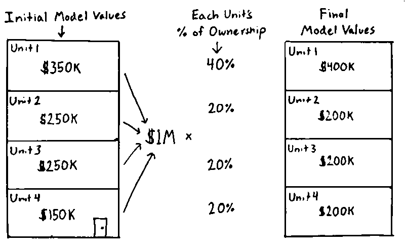

Table of Contents
================

- [Prior Models](#prior-models)
- [Model Overview](#model-overview)
  - [Differences Compared to the Residential
    Model](#differences-compared-to-the-residential-model)
    - [Features Used](#features-used)
    - [Valuation](#valuation)
    - [Multi-sales](#multi-sales)
  - [Condo Strata](#condo-strata)
- [Ongoing Issues](#ongoing-issues)
  - [Unit Heterogeneity](#unit-heterogeneity)
  - [Buildings With Few Sales](#buildings-with-few-sales)
  - [Buildings Without Sales](#buildings-without-sales)
- [FAQs](#faqs)
- [Usage](#usage)
  - [Getting Data](#getting-data)
- [License](#license)
- [Contributing](#contributing)

<!-- README.md is generated from README.Rmd. Please edit that file -->

> :warning: **NOTE** :warning:
>
> The [condominium model](https://github.com/ccao-data/model-condo-avm)
> (this repo) is nearly identical to the [residential
> (single/multi-family)
> model](https://github.com/ccao-data/model-res-avm), with a few [key
> differences](#differences-compared-to-the-residential-model). Please
> read the documentation for the [residential
> model](https://github.com/ccao-data/model-res-avm) first.

# Prior Models

This repository contains code, data, and documentation for the Cook
County Assessor’s condominium reassessment model. Information about
prior year models can be found at the following links:

| Year(s) | Triad(s) | Method                                      | Language / Framework       | Link                                                                                                                                       |
|---------|----------|---------------------------------------------|----------------------------|--------------------------------------------------------------------------------------------------------------------------------------------|
| 2015    | City     | N/A                                         | SPSS                       | [Link](https://gitlab.com/ccao-data-science---modeling/ccao_sf_cama_dev/-/tree/master/code.legacy/2015%20City%20Tri/2015%20Condo%20Models) |
| 2018    | City     | N/A                                         | N/A                        | Not available. Values provided by vendor                                                                                                   |
| 2019    | North    | Linear regression or GBM model per township | R (Base)                   | [Link](https://gitlab.com/ccao-data-science---modeling/ccao_sf_cama_dev)                                                                   |
| 2020    | South    | Linear regression or GBM model per township | R (Base)                   | [Link](https://gitlab.com/ccao-data-science---modeling/ccao_sf_cama_dev)                                                                   |
| 2021    | City     | County-wide LightGBM model                  | R (Tidyverse / Tidymodels) | [Link](https://github.com/ccao-data/model-condo-avm/tree/2021-assessment-year)                                                             |
| 2022    | North    | County-wide LightGBM model                  | R (Tidyverse / Tidymodels) | [Link](https://github.com/ccao-data/model-condo-avm/tree/2022-assessment-year)                                                             |
| 2023    | South    | County-wide LightGBM model                  | R (Tidyverse / Tidymodels) | [Link](https://github.com/ccao-data/model-condo-avm/tree/2023-assessment-year)                                                             |
| 2024    | City     | County-wide LightGBM model                  | R (Tidyverse / Tidymodels) | [Link](https://github.com/ccao-data/model-condo-avm/tree/2024-assessment-year)                                                             |
|         |          |                                             |                            |                                                                                                                                            |

# Model Overview

The duty of the Cook County Assessor’s Office is to value property in a
fair, accurate, and transparent way. The Assessor is committed to
transparency throughout the assessment process. As such, this document
contains:

- [A description of the differences between the residential model and
  this (condominium)
  model](#differences-compared-to-the-residential-model)
- [An outline of ongoing issues specific to condominium
  assessments](#ongoing-issues)

The repository itself contains the [code](./pipeline) for the Automated
Valuation Model (AVM) used to generate initial assessed values for all
condominium properties in Cook County. This system is effectively an
advanced machine learning model (hereafter referred to as “the model”).
It uses previous sales to generate estimated sale values (assessments)
for all properties.

## Differences Compared to the Residential Model

The Cook County Assessor’s Office has started to track a limited number
of characteristics (building-level square footage, unit-level square
footage, bedrooms, and bathrooms) for condominiums, but the data we have
***varies in both the characteristics available and their
completeness*** between triads. Staffing limitations have forced the
office to prioritize smaller condo buildings less likely to have recent
unit sales in certain parts of the county. Like most assessors
nationwide, our office staff cannot enter buildings to observe property
characteristics. For condos, this means we cannot observe amenities,
quality, or any other interior characteristics which must instead be
gathered from listings and a number of additional third-party sources.

The only complete information our office currently has about individual
condominium units is their age, location, sale date/price, and
percentage of ownership. This makes modeling condos particularly
challenging, as the number of usable features is quite small.
Fortunately, condos have two qualities which make modeling a bit easier:

1.  Condos are more homogeneous than single/multi-family properties,
    i.e. the range of potential condo sale prices is much narrower.
2.  Condo are pre-grouped into clusters of like units (buildings), and
    units within the same building usually have similar sale prices.

We leverage these qualities to produce what we call ***strata***, a
feature unique to the condo model. See [Condo Strata](#condo-strata) for
more information about how strata is used and calculated.

### Features Used

Because our individual condo unit characteristics are sparse and
incomplete, we primarily must rely on aggregate geospatial features,
economic features, [strata](#condo-strata), and time of sale to
determine condo assessed values. The features in the table below are the
ones used in the 2023 assessment model.

| Feature Name                                                            | Category       | Type      | Notes                                                                                                                                                 | Unique to Condo Model |
|:------------------------------------------------------------------------|:---------------|:----------|:------------------------------------------------------------------------------------------------------------------------------------------------------|:----------------------|
| Condominium Building Year Built                                         | Characteristic | numeric   | Year the property was constructed                                                                                                                     | X                     |
| Total Condominium Building Livable Parcels                              | Characteristic | numeric   | Count of livable 14-digit PINs (AKA condo units)                                                                                                      | X                     |
| Total Condominium Building Non-Livable Parcels                          | Characteristic | numeric   | Count of non-livable 14-digit PINs                                                                                                                    | X                     |
| Condominium Building Is Mixed Use                                       | Characteristic | logical   | The 10-digit PIN (building) contains a 14-digit PIN that is neither class 299 nor 399                                                                 | X                     |
| Total Condominium Building Square Footage                               | Characteristic | numeric   | Square footage of the *building* (PIN10) containing this unit                                                                                         | X                     |
| Building Square Footage                                                 | Characteristic | numeric   | Square footage of the *building* (PIN10) containing this unit                                                                                         | X                     |
| Condominium Unit Square Footage                                         | Characteristic | numeric   | Square footage of the condominium unit associated with this PIN                                                                                       | X                     |
| Unit Square Footage                                                     | Characteristic | numeric   | Square footage of the condominium unit associated with this PIN                                                                                       | X                     |
| Condominium Unit Bedrooms                                               | Characteristic | numeric   | Number of bedrooms in the building                                                                                                                    | X                     |
| Bedrooms                                                                | Characteristic | numeric   | Number of bedrooms in the building                                                                                                                    | X                     |
| Condominium Unit Half Baths                                             | Characteristic | numeric   | Number of half baths                                                                                                                                  | X                     |
| Half Baths                                                              | Characteristic | numeric   | Number of half baths                                                                                                                                  | X                     |
| Condominium Unit Full Baths                                             | Characteristic | numeric   | Number of full bathrooms                                                                                                                              | X                     |
| Full Baths                                                              | Characteristic | numeric   | Number of full bathrooms                                                                                                                              | X                     |
| Condominium % Ownership                                                 | Meta           | numeric   | Proration rate applied to the PIN                                                                                                                     | X                     |
| Condominium Building Strata 1                                           | Meta           | character | Condominium Building Strata - 10 Levels                                                                                                               | X                     |
| Condominium Building Strata 2                                           | Meta           | character | Condominium Building Strata - 100 Levels                                                                                                              | X                     |
| Land Square Feet                                                        | Characteristic | numeric   | Square footage of the land (not just the building) of the property                                                                                    |                       |
| Township Code                                                           | Meta           | character | Cook County township code                                                                                                                             |                       |
| Neighborhood Code                                                       | Meta           | character | Assessor neighborhood code                                                                                                                            |                       |
| Sale Year                                                               | Time           | numeric   | Sale year calculated as the number of years since 0 B.C.E                                                                                             |                       |
| Sale Day                                                                | Time           | numeric   | Sale day calculated as the number of days since January 1st, 1997                                                                                     |                       |
| Sale Quarter of Year                                                    | Time           | character | Character encoding of quarter of year (Q1 - Q4)                                                                                                       |                       |
| Sale Month of Year                                                      | Time           | character | Character encoding of month of year (Jan - Dec)                                                                                                       |                       |
| Sale Day of Year                                                        | Time           | numeric   | Numeric encoding of day of year (1 - 365)                                                                                                             |                       |
| Sale Day of Month                                                       | Time           | numeric   | Numeric encoding of day of month (1 - 31)                                                                                                             |                       |
| Sale Day of Week                                                        | Time           | numeric   | Numeric encoding of day of week (1 - 7)                                                                                                               |                       |
| Sale After COVID-19                                                     | Time           | logical   | Indicator for whether sale occurred after COVID-19 was widely publicized (around March 15, 2020)                                                      |                       |
| Percent Population Age, Under 19 Years Old                              | acs5           | numeric   | Percent of the people 17 years or younger                                                                                                             |                       |
| Percent Population Age, Over 65 Years Old                               | acs5           | numeric   | Percent of the people 65 years or older                                                                                                               |                       |
| Median Population Age                                                   | acs5           | numeric   | Median age for whole population                                                                                                                       |                       |
| Percent Population Mobility, Moved From Other State in Past Year        | acs5           | numeric   | Percent of people (older than 1 year) who moved from another state in the past 12 months                                                              |                       |
| Percent Households Family, Married                                      | acs5           | numeric   | Percent of households that are family, married                                                                                                        |                       |
| Percent Households Nonfamily, Living Alone                              | acs5           | numeric   | Percent of households that are non-family, alone (single)                                                                                             |                       |
| Percent Population Education, High School Degree                        | acs5           | numeric   | Percent of people older than 25 who attained a high school degree                                                                                     |                       |
| Percent Population Education, Bachelor Degree                           | acs5           | numeric   | Percent of people older than 25 who attained a bachelor’s degree                                                                                      |                       |
| Percent Population Education, Graduate Degree                           | acs5           | numeric   | Percent of people older than 25 who attained a graduate degree                                                                                        |                       |
| Percent Population Income, Below Poverty Level                          | acs5           | numeric   | Percent of people above the poverty level in the last 12 months                                                                                       |                       |
| Median Income, Household in Past Year                                   | acs5           | numeric   | Median income per household in the past 12 months                                                                                                     |                       |
| Median Income, Per Capita in Past Year                                  | acs5           | numeric   | Median income per capita in the past 12 months                                                                                                        |                       |
| Percent Population Income, Received SNAP in Past Year                   | acs5           | numeric   | Percent of households that received SNAP in the past 12 months                                                                                        |                       |
| Percent Population Employment, Unemployed                               | acs5           | numeric   | Percent of people 16 years and older unemployed                                                                                                       |                       |
| Median Occupied Household, Total, Year Built                            | acs5           | numeric   | Median year built for all occupied households                                                                                                         |                       |
| Median Occupied Household, Renter, Gross Rent                           | acs5           | numeric   | Median gross rent for only renter-occupied units                                                                                                      |                       |
| Percent Occupied Households, Owner                                      | acs5           | numeric   | Percent of households that are owner-occupied                                                                                                         |                       |
| Percent Occupied Households, Total, One or More Selected Conditions     | acs5           | numeric   | Percent of occupied households with selected conditions                                                                                               |                       |
| Percent Population Mobility, Moved From Within Same County in Past Year | acs5           | numeric   | Percent of people (older than 1 year) who moved in county in the past 12 months                                                                       |                       |
| Active Homeowner Exemption                                              | ccao           | logical   | Parcel has an active homeowner exemption                                                                                                              |                       |
| Corner Lot                                                              | ccao           | logical   | Corner lot indicator                                                                                                                                  |                       |
| Number of Years Active Homeowner Exemption                              | ccao           | numeric   | Number of years parcel has had an active homeowner exemption                                                                                          |                       |
| Longitude                                                               | loc            | numeric   | X coordinate in degrees (global longitude)                                                                                                            |                       |
| Latitude                                                                | loc            | numeric   | Y coordinate in degrees (global latitude)                                                                                                             |                       |
| Census Tract GEOID                                                      | loc            | character | 11-digit ACS/Census tract GEOID                                                                                                                       |                       |
| First Street Factor                                                     | loc            | numeric   | First Street flood factor The flood factor is a risk score, where 10 is the highest risk and 1 is the lowest risk                                     |                       |
| School Elementary District GEOID                                        | loc            | character | School district (elementary) GEOID                                                                                                                    |                       |
| School Secondary District GEOID                                         | loc            | character | School district (secondary) GEOID                                                                                                                     |                       |
| CMAP Walkability Score (No Transit)                                     | loc            | numeric   | CMAP walkability score for a given PIN, excluding transit walkability                                                                                 |                       |
| CMAP Walkability Total Score                                            | loc            | numeric   | CMAP walkability score for a given PIN, including transit walkability                                                                                 |                       |
| Municipality Name                                                       | loc            | character | Taxing district name, as seen on Cook County tax bills                                                                                                |                       |
| Property Tax Bill Aggregate Rate                                        | other          | numeric   | Tax bill rate for the taxing district containing a given PIN                                                                                          |                       |
| Number of PINs in Half Mile                                             | prox           | numeric   | Number of PINs within half mile                                                                                                                       |                       |
| Number of Bus Stops in Half Mile                                        | prox           | numeric   | Number of bus stops within half mile                                                                                                                  |                       |
| Number of Foreclosures Per 1000 PINs (Past 5 Years)                     | prox           | numeric   | Number of foreclosures per 1000 PINs, within half mile (past 5 years)                                                                                 |                       |
| Number of Schools in Half Mile                                          | prox           | numeric   | Number of schools (any kind) within half mile                                                                                                         |                       |
| Total Airport Noise DNL                                                 | prox           | numeric   | Estimated DNL for a PIN, assuming a baseline DNL of 50 (“quiet suburban”) and adding predicted noise from O’Hare and Midway airports to that baseline |                       |
| Nearest Bike Trail Distance (Feet)                                      | prox           | numeric   | Nearest bike trail distance (feet)                                                                                                                    |                       |
| Nearest Cemetery Distance (Feet)                                        | prox           | numeric   | Nearest cemetery distance (feet)                                                                                                                      |                       |
| Nearest CTA Route Distance (Feet)                                       | prox           | numeric   | Nearest CTA route distance (feet)                                                                                                                     |                       |
| Nearest CTA Stop Distance (Feet)                                        | prox           | numeric   | Nearest CTA stop distance (feet)                                                                                                                      |                       |
| Nearest Hospital Distance (Feet)                                        | prox           | numeric   | Nearest hospital distance (feet)                                                                                                                      |                       |
| Lake Michigan Distance (Feet)                                           | prox           | numeric   | Distance to Lake Michigan shoreline (feet)                                                                                                            |                       |
| Nearest Major Road Distance (Feet)                                      | prox           | numeric   | Nearest major road distance (feet)                                                                                                                    |                       |
| Nearest Metra Route Distance (Feet)                                     | prox           | numeric   | Nearest Metra route distance (feet)                                                                                                                   |                       |
| Nearest Metra Stop Distance (Feet)                                      | prox           | numeric   | Nearest Metra stop distance (feet)                                                                                                                    |                       |
| Nearest Park Distance (Feet)                                            | prox           | numeric   | Nearest park distance (feet)                                                                                                                          |                       |
| Nearest Railroad Distance (Feet)                                        | prox           | numeric   | Nearest railroad distance (feet)                                                                                                                      |                       |
| Nearest Secondary Road Distance (Feet)                                  | prox           | numeric   | Nearest secondary road distance (feet)                                                                                                                |                       |
| Nearest University Distance (Feet)                                      | prox           | numeric   | Nearest university distance (feet)                                                                                                                    |                       |
| Nearest Vacant Land Parcel Distance (Feet)                              | prox           | numeric   | Nearest vacant land (class 100) parcel distance (feet)                                                                                                |                       |
| Nearest Water Distance (Feet)                                           | prox           | numeric   | Nearest water distance (feet)                                                                                                                         |                       |
| Nearest Golf Course Distance (Feet)                                     | prox           | numeric   | Nearest golf course distance (feet)                                                                                                                   |                       |

### Valuation

For the most part, condos are valued the same way as single- and
multi-family residential property. We [train a
model](https://github.com/ccao-data/model-res-avm#how-it-works) using
individual condo unit sales, predict the value of all units, and then
apply any [post-modeling
adjustment](https://github.com/ccao-data/model-res-avm#post-modeling).

However, because the CCAO has so [little information about individual
units](#differences-compared-to-the-residential-model), we must rely on
the [condominium percentage of ownership](#features-used) to
differentiate between units in a building. This feature is effectively
the proportion of the building’s overall value held by a unit. It is
created when a condominium declaration is filed with the County (usually
by the developer of the building). The critical assumption underlying
the condo valuation process is that percentage of ownership correlates
with current market value.

Percentage of ownership is used in two ways:

1.  It is used directly as a predictor/feature in the regression model
    to estimate differing unit values within the same building.
2.  It is used to reapportion unit values directly i.e. the value of a
    unit is ultimately equal to `% of ownership * total building value`.

Visually, this looks like:



For what the office terms “nonlivable” spaces — parking spaces, storage
space, and common area — the breakout of value works differently. See
[this excel sheet](docs/spreadsheets/condo_nonlivable_demo.xlsx) for an
interactive example of how nonlivable spaces are valued based on the
total value of a building’s livable space.

Percentage of ownership is the single most important feature in the
condo model. It determines almost all intra-building differences in unit
values.

### Multi-sales

The condo model is trained on a select number of “multi-sales” in
addition to single-parcel sales. Multi-sales are sales that include more
than one parcel. In the case of condominiums, many units are sold
bundled with deeded parking spaces that are separate parcels. These
two-parcel sales are highly reflective of the unit’s actual market
price. We split the total value of these two-parcel sales according to
their relative percent of ownership before using them for training. For
a \$100,000 sale of a unit (4% ownership) and a parking space (1%
ownership), the sale would be adjusted to \$80,000:

$$\frac{0.04}{0.04 + 0.01} * \$100,000 = \$80,000$$

## Condo Strata

The condo model uses an engineered feature called *strata* to deliver
much of its predictive power. Strata is the binned, time-weighted,
5-year average sale price of the building. There are two strata features
used in the model, one with 10 bins and one with 300 bins. Buildings are
binned across each triad using either quantiles or 1-dimensional
k-means. A visual representation of quantile-based strata binning looks
like:


To put strata in more concrete terms, the table below shows a sample
5-level strata. Each condominium unit would be assigned a strata from
this table (Strata 1, Strata 2, etc.) based on the 5-year weighted
average sale price of its building. All units in a building will have
the same strata.

| Strata   | Range of 5-year Average Sale Price |
|:---------|:-----------------------------------|
| Strata 1 | \$0 - \$121K                       |
| Strata 2 | \$121K - \$149K                    |
| Strata 3 | \$149K - \$199K                    |
| Strata 4 | \$199K - \$276K                    |
| Strata 5 | \$276K+                            |

Some additional notes on strata:

- Strata is calculated in the [ingest stage](./pipeline/00-ingest.R) of
  this repository.
- Calculating the 5-year average sale price of a building requires at
  least 1 sale. Buildings with no sales have their strata imputed via
  KNN (using year built, number of units, and location as features).
- Number of bins (10 and 100) was chosen based on model performance.
  These numbers yielded the lowest root mean-squared error (RMSE).

# Ongoing Issues

The CCAO faces a number of ongoing issues specific to condominium
modeling. We are currently working on processes to fix these issues. We
list the issues here for the sake of transparency and to provide a sense
of the challenges we face.

### Unit Heterogeneity

The current modeling methodology for condominiums makes two assumptions:

1.  Condos units within the same building are similar and will sell for
    similar amounts.
2.  If units are not similar, the percentage of ownership will
    accurately reflect and be proportional to any difference in value
    between units.

The model process works even in heterogeneous buildings as long as
assumption 2 is met. For example, imagine a building with 8 identical
units and 1 penthouse unit. This building violates assumption 1 because
the penthouse unit is likely larger and worth more than the other 10.
However, if the percentage of ownership of each unit is roughly
proportional to its value, then each unit will still receive a fair
assessment.

However, the model can produce poor results when both of these
assumptions are violated. For example, if a building has an extreme mix
of different units, each with the same percentage of ownership, then
smaller, less expensive units will be overvalued and larger, more
expensive units will be undervalued.

This problem is rare, but does occur in certain buildings with many
heterogeneous units. Such buildings typically go through a process of
secondary review to ensure the accuracy of the individual unit values.

### Buildings With Few Sales

The condo model relies on sales within the same building to calculate
[strata](#condo-strata). This method works well for large buildings with
many sales, but can break down when there are only 1 or 2 sales in a
building. The primary danger here is *unrepresentative* sales,
i.e. sales that deviate significantly from the real average value of a
building’s units. When this happens, buildings can have their average
unit sale value pegged too high or low.

Fortunately, buildings without any recent sales are relatively rare, as
condos have a higher turnover rate than single and multi-family
property. Smaller buildings with low turnover are the most likely to not
have recent sales.

### Buildings Without Sales

When no sales have occurred in a building in the 5 years prior to
assessment, the building’s strata features are imputed. The model will
look at nearby buildings that have similar unit counts/age and then try
to assign an appropriate strata to the target building.

Most of the time, this technique produces reasonable results. However,
buildings without sales still go through an additional round of review
to ensure the accuracy of individual unit values.

# FAQs

**Note:** The FAQs listed here are for condo-specific questions. See the
residential model documentation for [more general
FAQs](https://github.com/ccao-data/model-res-avm#faqs).

**Q: What are the most important features in the condo model?**

As with the [residential
model](https://github.com/ccao-data/model-res-avm), the importance of
individual features varies by location and time. However, generally
speaking, the most important features are:

- Location, location, location. Location is the largest driver of
  county-wide variation in condo value. We account for location using
  [geospatial features like neighborhood](#features-used).
- Condo percentage of ownership, which determines the intra-building
  variation in unit price.
- [Condo building strata](#condo-strata). Strata provides us with a good
  estimate of the average sale price of a building’s units.

**Q: How do I see my condo building’s strata?**

Individual building [strata](#condo-strata) are not included with
assessment notices or shown on the CCAO’s website. However, strata *are*
stored in the sample data included in this repository. You can load the
data
([`input/condo_strata_data.parquet`](./input/condo_strata_data.parquet))
using R and the `read_parquet()` function from the `arrow` library.

**Q: How do I see the assessed value of other units in my building?**

You can use the [CCAO’s Address
Search](https://www.cookcountyassessor.com/address-search#address) to
see all the PINs and values associated with a specific condominium
building, simply leave the `Unit Number` field blank when submitting a
search.

**Q: How do I view my unit’s percentage of ownership?**

The percentage of ownership for individual units is printed on
assessment notices. You may also be able to find it via your building’s
board or condo declaration.

# Usage

Installation and usage of this model is identical to the [installation
and usage of the residential
model](https://github.com/ccao-data/model-res-avm#usage). Please follow
the instructions listed there.

## Getting Data

The data required to run these scripts is produced by the [ingest
stage](pipeline/00-ingest.R), which uses SQL pulls from the CCAO’s
Athena database as a primary data source. CCAO employees can run the
ingest stage or pull the latest version of the input data from our
internal DVC store using:

``` bash
dvc pull
```

Public users can download data for each assessment year using the links
below. Each file should be placed in the `input/` directory prior to
running the model pipeline.

#### 2021

- [assmntdata.parquet](https://ccao-data-public-us-east-1.s3.amazonaws.com/models/inputs/condo/2021/assmntdata.parquet)
- [modeldata.parquet](https://ccao-data-public-us-east-1.s3.amazonaws.com/models/inputs/condo/2021/modeldata.parquet)

#### 2022

- [assessment_data.parquet](https://ccao-data-public-us-east-1.s3.amazonaws.com/models/inputs/condo/2022/assessment_data.parquet)
- [condo_strata_data.parquet](https://ccao-data-public-us-east-1.s3.amazonaws.com/models/inputs/condo/2022/condo_strata_data.parquet)
- [land_nbhd_rate_data.parquet](https://ccao-data-public-us-east-1.s3.amazonaws.com/models/inputs/condo/2022/land_nbhd_rate_data.parquet)
- [training_data.parquet](https://ccao-data-public-us-east-1.s3.amazonaws.com/models/inputs/condo/2022/training_data.parquet)

#### 2023

- [assessment_data.parquet](https://ccao-data-public-us-east-1.s3.amazonaws.com/models/inputs/condo/2023/assessment_data.parquet)
- [condo_strata_data.parquet](https://ccao-data-public-us-east-1.s3.amazonaws.com/models/inputs/condo/2023/condo_strata_data.parquet)
- [land_nbhd_rate_data.parquet](https://ccao-data-public-us-east-1.s3.amazonaws.com/models/inputs/condo/2023/land_nbhd_rate_data.parquet)
- [training_data.parquet](https://ccao-data-public-us-east-1.s3.amazonaws.com/models/inputs/condo/2023/training_data.parquet)

#### 2024

- [assessment_data.parquet](https://ccao-data-public-us-east-1.s3.amazonaws.com/models/inputs/condo/2024/assessment_data.parquet)
- [char_data.parquet](https://ccao-data-public-us-east-1.s3.amazonaws.com/models/inputs/condo/2024/char_data.parquet)
- [condo_strata_data.parquet](https://ccao-data-public-us-east-1.s3.amazonaws.com/models/inputs/condo/2024/condo_strata_data.parquet)
- [land_nbhd_rate_data.parquet](https://ccao-data-public-us-east-1.s3.amazonaws.com/models/inputs/condo/2024/land_nbhd_rate_data.parquet)
- [training_data.parquet](https://ccao-data-public-us-east-1.s3.amazonaws.com/models/inputs/condo/2024/training_data.parquet)

For other data from the CCAO, please visit the [Cook County Data
Portal](https://datacatalog.cookcountyil.gov/).

# License

Distributed under the AGPL-3 License. See [LICENSE](./LICENSE) for more
information.

# Contributing

We welcome pull requests, comments, and other feedback via GitHub. For
more involved collaboration or projects, please see the [Developer
Engagement Program](https://github.com/ccao-data/people#external)
documentation on our group wiki.
