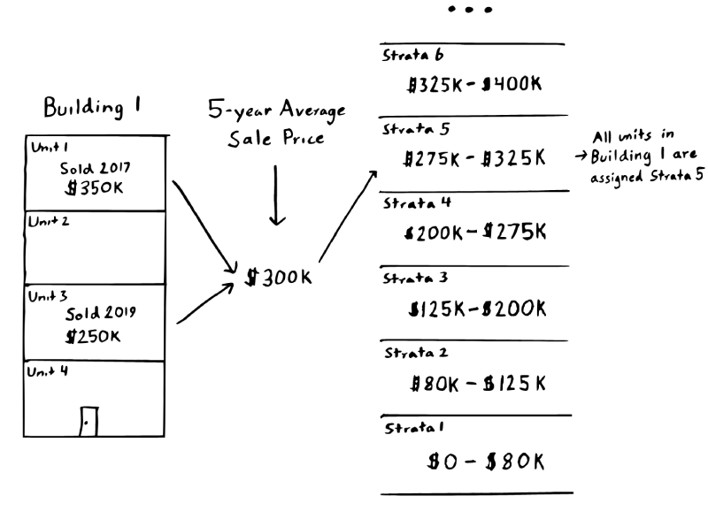

Table of Contents
================

-   [Prior Models](#prior-models)
-   [Model Overview](#model-overview)
    -   [Differences Compared to the Residential
        Model](#differences-compared-to-the-residential-model)
        -   [Features Used](#features-used)
        -   [Valuation](#valuation)
    -   [Condo Strata](#condo-strata)
-   [Ongoing Issues](#ongoing-issues)
    -   [Unit Heterogeneity](#unit-heterogeneity)
    -   [Buildings With Few Sales](#buildings-with-few-sales)
    -   [Buildings Without Sales](#buildings-without-sales)
-   [FAQs](#faqs)
-   [Usage](#usage)
-   [License](#license)
-   [Contributing](#contributing)

<!-- README.md is generated from README.Rmd. Please edit that file -->

> :warning: **NOTE** :warning:
>
> The [condominium
> model](https://gitlab.com/ccao-data-science---modeling/models/ccao_condo_avm)
> (this repo) is nearly identical to the [residential
> (single/multi-family)
> model](https://gitlab.com/ccao-data-science---modeling/models/ccao_res_avm),
> with a few [key
> differences](#differences-compared-to-the-residential-model). Please
> read the documentation for the [residential
> model](https://gitlab.com/ccao-data-science---modeling/models/ccao_res_avm)
> first.

# Prior Models

This repository contains code, data, and documentation for the Cook
County Assessor’s 2022 condominium reassessment model. Information about
prior year models can be found at the following links:

| Year(s) | Triad(s) | Method                                      | Language / Framework       | Link                                                                                                                                       |
|---------|----------|---------------------------------------------|----------------------------|--------------------------------------------------------------------------------------------------------------------------------------------|
| 2015    | City     | N/A                                         | SPSS                       | [Link](https://gitlab.com/ccao-data-science---modeling/ccao_sf_cama_dev/-/tree/master/code.legacy/2015%20City%20Tri/2015%20Condo%20Models) |
| 2018    | City     | N/A                                         | N/A                        | Not available. Values provided by vendor                                                                                                   |
| 2019    | North    | Linear regression or GBM model per township | R (Base)                   | [Link](https://gitlab.com/ccao-data-science---modeling/ccao_sf_cama_dev)                                                                   |
| 2020    | South    | Linear regression or GBM model per township | R (Base)                   | [Link](https://gitlab.com/ccao-data-science---modeling/ccao_sf_cama_dev)                                                                   |
| 2021    | City     | County-wide LightGBM model                  | R (Tidyverse / Tidymodels) | [Link](https://gitlab.com/ccao-data-science---modeling/models/ccao_condo_avm/-/tree/2021-assessment-year)                                  |

# Model Overview

The duty of the Cook County Assessor’s Office is to value property in a
fair, accurate, and transparent way. The Assessor is committed to
transparency throughout the assessment process. As such, this document
contains:

-   [A description of the differences between the residential model and
    this (condominium)
    model](#differences-compared-to-the-residential-model)
-   [An outline of ongoing issues specific to condominium
    assessments](#ongoing-issues)

The repository itself contains the [code](./pipeline) and
[data](./input) for the Automated Valuation Model (AVM) used to generate
initial assessed values for all condominium properties in Cook County.
This system is effectively an advanced machine learning model (hereafter
referred to as “the model”). It uses previous sales to generate
estimated sale values (assessments) for all properties.

## Differences Compared to the Residential Model

The Cook County Assessor’s Office ***does not track characteristic data
for condominiums***. Like most assessors nationwide, our office staff
cannot enter buildings to observe property characteristics. For condos,
this means we cannot observe amenities, quality, or any other interior
characteristics.

The only information our office has about individual condominium units
is their age, location, sale date/price, and percentage of ownership.
This makes modeling condos particularly challenging, as the number of
usable features is quite small. Fortunately, condos have two qualities
which make modeling a bit easier:

1.  Condos are more homogeneous than single/multi-family properties,
    i.e. the range of potential condo sale prices is much narrower.
2.  Condo are pre-grouped into clusters of like units (buildings), and
    units within the same building usually have similar sale prices.

We leverage these qualities to produce what we call ***strata***, a
feature unique to the condo model. See [Condo Strata](#condo-strata) for
more information about how strata is used and calculated.

> :warning: **NOTE** :warning:
>
> This year, the CCAO has started to manually collect high-level
> condominium data, including total building square footage and
> estimated unit square footage/number of bedrooms. This data is sourced
> from listings and a number of additional third-party sources and is
> available for the North triad only.

### Features Used

Because our office (mostly) cannot observe individual condo unit
characteristics, we must rely on aggregate geospatial features, economic
features, [strata](#condo-strata), and time of sale to determine condo
assessed values. The features in the table below are the ones used in
the 2022 assessment model.

| Feature Name                                                            | Category       | Type      | Unique to Condo Model |
|:------------------------------------------------------------------------|:---------------|:----------|:----------------------|
| Condominium Building Year Built                                         | Characteristic | numeric   | X                     |
| Condominium % Ownership                                                 | Characteristic | numeric   | X                     |
| Total Condominium Building Parcels                                      | Characteristic | numeric   | X                     |
| Total Condominium Building Non-Livable Parcels                          | Characteristic | numeric   | X                     |
| Total Condominium Building Livable Parcels                              | Characteristic | numeric   | X                     |
| Total Condominium Building Square Footage                               | Characteristic | numeric   | X                     |
| Condominium Unit Bedrooms                                               | Characteristic | numeric   | X                     |
| Condominium Unit Square Footage                                         | Characteristic | numeric   | X                     |
| Condominium Building Is Mixed Use                                       | Characteristic | logical   | X                     |
| Condominium Building Strata 1                                           | Meta           | character | X                     |
| Condominium Building Strata 2                                           | Meta           | character | X                     |
| Percent Population Age, Under 19 Years Old                              | acs5           | numeric   |                       |
| Percent Population Age, Over 65 Years Old                               | acs5           | numeric   |                       |
| Median Population Age                                                   | acs5           | numeric   |                       |
| Percent Population Mobility, In Same House 1 Year Ago                   | acs5           | numeric   |                       |
| Percent Population Mobility, Moved From Other State in Past Year        | acs5           | numeric   |                       |
| Percent Households Family, Married                                      | acs5           | numeric   |                       |
| Percent Households Nonfamily, Living Alone                              | acs5           | numeric   |                       |
| Percent Population Education, High School Degree                        | acs5           | numeric   |                       |
| Percent Population Education, Bachelor Degree                           | acs5           | numeric   |                       |
| Percent Population Education, Graduate Degree                           | acs5           | numeric   |                       |
| Percent Population Income, Below Poverty Level                          | acs5           | numeric   |                       |
| Median Income, Household in Past Year                                   | acs5           | numeric   |                       |
| Median Income, Per Capita in Past Year                                  | acs5           | numeric   |                       |
| Percent Population Income, Received SNAP in Past Year                   | acs5           | numeric   |                       |
| Percent Population Employment, Unemployed                               | acs5           | numeric   |                       |
| Median Occupied Household, Total, Year Built                            | acs5           | numeric   |                       |
| Median Occupied Household, Renter, Gross Rent                           | acs5           | numeric   |                       |
| Median Occupied Household, Owner, Market Value                          | acs5           | numeric   |                       |
| Percent Occupied Households, Owner                                      | acs5           | numeric   |                       |
| Percent Occupied Households, Total, One or More Selected Conditions     | acs5           | numeric   |                       |
| Percent Population Mobility, Moved From Within Same County in Past Year | acs5           | numeric   |                       |
| Longitude                                                               | loc            | numeric   |                       |
| Latitude                                                                | loc            | numeric   |                       |
| Municipality Name                                                       | loc            | character |                       |
| FEMA Special Flood Hazard Area                                          | loc            | logical   |                       |
| First Street Factor                                                     | loc            | numeric   |                       |
| First Street Risk Direction                                             | loc            | numeric   |                       |
| O’Hare Noise Contour No Buffer Boolean                                  | loc            | logical   |                       |
| School Elementary District GEOID                                        | loc            | character |                       |
| School Secondary District GEOID                                         | loc            | character |                       |
| School Unified District GEOID                                           | loc            | character |                       |
| Special Service Area Number                                             | loc            | character |                       |
| CMAP Walkability Score (No Transit)                                     | loc            | numeric   |                       |
| CMAP Walkability Total Score                                            | loc            | numeric   |                       |
| Subdivision ID                                                          | loc            | character |                       |
| Unincorporated Area Boolean                                             | loc            | logical   |                       |
| Airport Noise DNL                                                       | loc            | numeric   |                       |
| Township Code                                                           | Meta           | character |                       |
| Neighborhood Code                                                       | Meta           | character |                       |
| 2 Years Prior BoR Assessed Value (Total)                                | Meta           | numeric   |                       |
| Mailed Assessed Value (Total)                                           | Meta           | numeric   |                       |
| DePaul IHS Average Year Index                                           | other          | numeric   |                       |
| Property Tax Bill Aggregate Rate                                        | other          | numeric   |                       |
| School District (Elementary) GreatSchools Rating                        | other          | numeric   |                       |
| School District (Secondary) GreatSchools Rating                         | other          | numeric   |                       |
| Number of PINs in Half Mile                                             | prox           | numeric   |                       |
| Number of Bus Stops in Half Mile                                        | prox           | numeric   |                       |
| Number of Foreclosures Per 1000 PINs (Past 5 Years)                     | prox           | numeric   |                       |
| Number of Schools in Half Mile                                          | prox           | numeric   |                       |
| Number of Schools with Rating in Half Mile                              | prox           | numeric   |                       |
| Average School Rating in Half Mile                                      | prox           | numeric   |                       |
| Nearest Bike Trail Distance (Feet)                                      | prox           | numeric   |                       |
| Nearest Cemetery Distance (Feet)                                        | prox           | numeric   |                       |
| Nearest CTA Route Distance (Feet)                                       | prox           | numeric   |                       |
| Nearest CTA Stop Distance (Feet)                                        | prox           | numeric   |                       |
| Nearest Hospital Distance (Feet)                                        | prox           | numeric   |                       |
| Lake Michigan Distance (Feet)                                           | prox           | numeric   |                       |
| Nearest Major Road Distance (Feet)                                      | prox           | numeric   |                       |
| Nearest Metra Route Distance (Feet)                                     | prox           | numeric   |                       |
| Nearest Metra Stop Distance (Feet)                                      | prox           | numeric   |                       |
| Nearest Park Distance (Feet)                                            | prox           | numeric   |                       |
| Nearest Railroad Distance (Feet)                                        | prox           | numeric   |                       |
| Nearest Water Distance (Feet)                                           | prox           | numeric   |                       |
| Sale Year                                                               | Time           | numeric   |                       |
| Sale Day                                                                | Time           | numeric   |                       |
| Sale Quarter of Year                                                    | Time           | character |                       |
| Sale Month of Year                                                      | Time           | character |                       |
| Sale Day of Year                                                        | Time           | numeric   |                       |
| Sale Day of Month                                                       | Time           | numeric   |                       |
| Sale Day of Week                                                        | Time           | numeric   |                       |
| Sale After COVID-19                                                     | Time           | logical   |                       |

### Valuation

For the most part, condos are valued the same way as single- and
multi-family residential property: we [train a
model](https://gitlab.com/ccao-data-science---modeling/models/ccao_res_avm#how-it-works)
using individual condo unit sales, predict the value of unsold units,
and then apply any [post-modeling
adjustment](https://gitlab.com/ccao-data-science---modeling/models/ccao_res_avm#post-modeling).

However, because the CCAO has so [little information about individual
units](#differences-compared-to-the-residential-model), we must rely on
the [condominium percentage of ownership](#features-used) to
differentiate between units in a building. This feature is effectively a
percentage of the building’s overall value. It is created when a
condominium declaration is filed with the County (usually by the
developer of the building).

Percentage of ownership is the single most important feature in the
condo model. It determines almost all intra-building differences in unit
values.

## Condo Strata

The condo model uses an engineered feature called *strata* to deliver
much of its predictive power. Strata is the binned, time-weighted,
5-year average sale price of the building. There are two strata features
used in the model, one with 10 bins and one with 300 bins. Buildings are
binned across each triad using either quantiles or 1-dimensional
k-means. A visual representation of quantile-based strata binning looks
like:

To put strata in more concrete terms, the table below shows a sample
5-level strata. Each condominium unit would be assigned a strata from
this table (Strata 1, Strata 2, etc.) based on the 5-year weighted
average sale price of its building. All units in a building will have
the same strata.

| Strata   | Range of 5-year Average Sale Price |
|:---------|:-----------------------------------|
| Strata 1 | $0 - $121K                         |
| Strata 2 | $121K - $149K                      |
| Strata 3 | $149K - $199K                      |
| Strata 4 | $199K - $276K                      |
| Strata 5 | $276K+                             |

Some additional notes on strata:

-   Strata is calculated in the [ingest stage](./pipeline/00-ingest.R)
    of this repository.
-   Calculating the 5-year average sale price of a building requires at
    least 1 sale. Buildings with no sales have their strata imputed via
    KNN (using year built, number of units, and location as features).
-   Number of bins (10 and 300) was chosen based on model performance.
    These numbers yielded the lowest root mean-squared error (RMSE).

# Ongoing Issues

The CCAO faces a number of ongoing issues specific to condominium
modeling. We are currently working on processes to fix these issues. We
list the issues here for the sake of transparency and to provide a sense
of the challenges we face.

### Unit Heterogeneity

The current modeling methodology for condominiums makes two assumptions:

1.  Condos units within the same building are similar and will sell for
    similar amounts.
2.  If units are not similar, the percentage of ownership will
    accurately reflect and be proportional to any difference in value
    between units.

The model process works even in heterogeneous buildings as long as
assumption 2 is met. For example, imagine a building with 8 identical
units and 1 penthouse unit. This building violates assumption 1 because
the penthouse unit is likely larger and worth more than the other 10.
However, if the percentage of ownership of each unit is roughly
proportional to its value, then each unit will still receive a fair
assessment.

However, the model can produce poor results when both of these
assumptions are violated. For example, if a building has an extreme mix
of different units, each with the same percentage of ownership, then
smaller, less expensive units will be overvalued and larger, more
expensive units will be undervalued.

This problem is rare, but does occur in certain buildings with many
heterogeneous units. Such buildings typically go through a process of
secondary review to ensure the accuracy of the individual unit values.

### Buildings With Few Sales

The condo model relies on sales within the same building to calculate
[strata](#condo-strata). This method works well for large buildings with
many sales, but can break down when there are only 1 or 2 sales in a
building. The primary danger here is *unrepresentative* sales,
i.e. sales that deviate significantly from the real average value of a
building’s units. When this happens, buildings can have their average
unit sale value pegged too high or low.

Fortunately, buildings without any recent sales are relatively rare, as
condos have a higher turnover rate than single and multi-family
property. Smaller buildings with low turnover are the most likely to not
have recent sales.

### Buildings Without Sales

When no sales have occurred in a building in the 5 years prior to
assessment, the building’s strata features are imputed. The model will
look at nearby buildings that have similar unit counts/age and then try
to assign an appropriate strata to the target building.

Most of the time, this technique produces reasonable results. However,
buildings without sales still go through an additional round of review
to ensure the accuracy of individual unit values.

# FAQs

**Note:** The FAQs listed here are for condo-specific questions. See the
residential model documentation for [more general
FAQs](https://gitlab.com/ccao-data-science---modeling/models/ccao_res_avm#faqs).

**Q: What are the most important features in the condo model?**

As with the [residential
model](https://gitlab.com/ccao-data-science---modeling/models/ccao_res_avm),
the importance of individual features varies by location and time.
However, generally speaking, the most important features are:

-   Location, location, location. Location is the largest driver of
    county-wide variation in condo value. We account for location using
    [geospatial features like
    neighborhood](https://gitlab.com/ccao-data-science---modeling/models/ccao_condo_avm#features-used).
-   Condo percentage of ownership, which determines the intra-building
    variation in unit price.
-   [Condo building strata](#condo-strata). Strata provides us with a
    good estimate of the average sale price of a building’s units.

**Q: How do I see my condo building’s strata?**

Individual building [strata](#condo-strata) are not included with
assessment notices or shown on the CCAO’s website. However, strata *are*
stored in the sample data included in this repository. You can load the
data (`input/condo_strata_data.parquet`) using R and the
`read_parquet()` function from the `arrow` library.

**Q: How do I see the assessed value of other units in my building?**

You can use the [CCAO’s Address
Search](https://www.cookcountyassessor.com/address-search#address) to
see all the PINs and values associated with a specific condominium
building, simply leave the `Unit Number` field blank when submitting a
search.

**Q: How do I view my unit’s percentage of ownership?**

The percentage of ownership for individual units is printed on
assessment notices. You may also be able to find it via your building’s
board or condo declaration.

# Usage

Installation and usage of this model is identical to the [installation
and usage of the residential
model](https://gitlab.com/ccao-data-science---modeling/models/ccao_res_avm#usage).
Please follow the instructions listed there.

# License

Distributed under the GPL-3 License. See [LICENSE](./LICENSE.txt) for
more information.

# Contributing

We welcome pull requests, comments, and other feedback via GitLab. For
more involved collaboration or projects, please see the [Developer
Engagement
Program](https://gitlab.com/groups/ccao-data-science---modeling/-/wikis/People/Contributing)
documentation on our group wiki.
